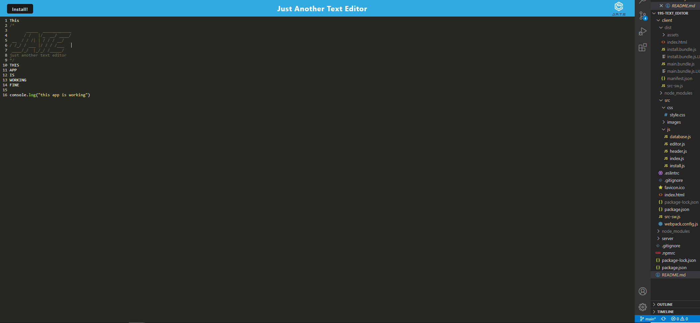

# 19s-TEXT_EDITOR

## Description

A text editor application that the user can install as a web app.

Deployed Page: https://jate-ss-uw-bootcamp.herokuapp.com/

## Table of Contents

- [Description](#description)
- [Instillation](#instillation)
- [Usage](#usage)
- [Contribution](#contribution)
- [Tests](#tests)
- [Questions](#questions)

## Instillation

To install the applitcaion the user must click the install button at the top right of the screen.

## Usage

A user can write/type on the application. which allows the to make small notes or test simple code even when not connected to the internet.

## Contribution

There are no contribution guidelines for this project

## Tests

There are no tests for this application

## Liscense

there was not need for a Liscnese on this project

https://unlicense.org/

## Questions

If you have any further questions contact me here:

Email: xavier.ray.marquez@gmail.com

github: [XavierMarqez](https://github.com/XavierReyMarquez)
